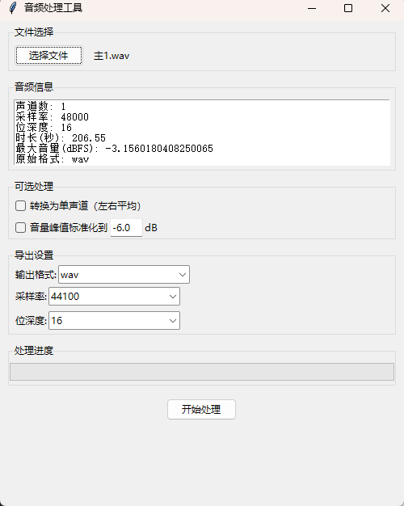

# 音频前期处理小工具

>  请确保安装了  `ffmpeg`

## 功能

- 音频格式转换（WAV/MP3/FLAC）
- 双声道转单声道
- 音量标准化
- 采样率调整

## 直接使用

1. 克隆仓库
2. 通过 `pipinstall-rrequirements.txt` 安装依赖
3. `python main.py` 即可

## 构建

运行 `packing.py` 即可
